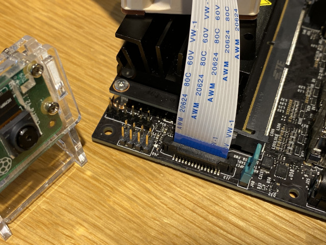
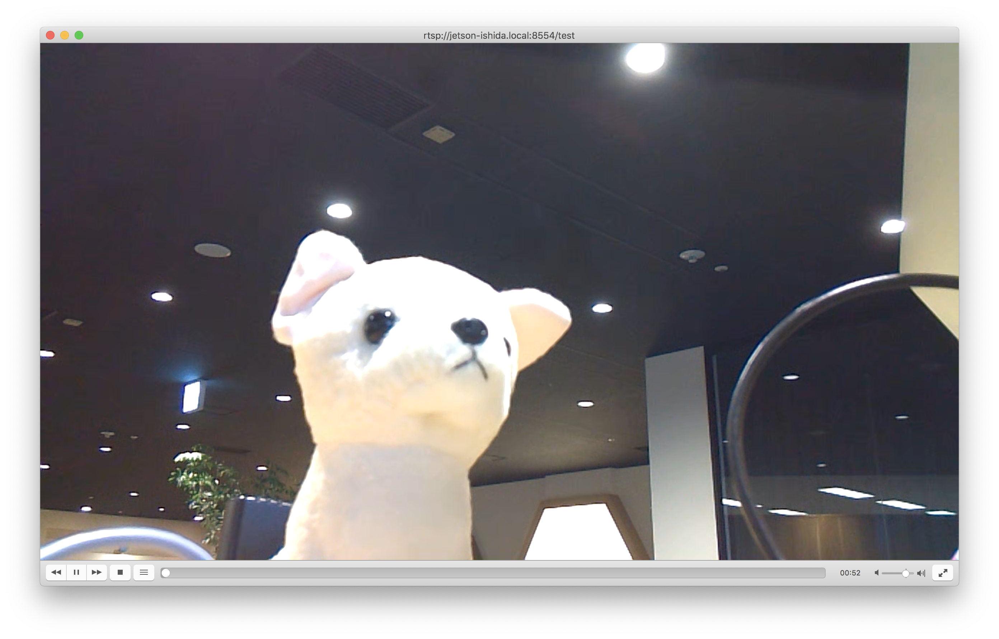

# カメラの画像をキャプチャする

Jetson Nano の基盤上にある J13 の端子には、Raspberry Pi 用のカメラ (v2) が接続できる。

## 注意事項
- **コネクタの操作は極めて壊れやすいので最新の注意が必要**
- **作業の前にシャットダウンしてACアダプタを抜いておく**

## 作業手順

### Jetson Nano のシャットダウン
```
$ sudo shutdown -h now
```

ACアダプタを外す。

### カメラを接続

コネクタはちょっと強く引っ張るとすぐに壊れる。**慎重に**。



カメラを接続して Jetson Nano を起動すると、特にドライバ等のセットアップも必要なく ```/dev/video0``` というデバイスが出現する。

### カメラで動画を撮影してRTSPで配信してみる

デバイスとして認識されていれば ```/dev/video0``` として見えているはず。

```
$ ls -l /dev/video0
crw-rw----+ 1 root video 81, 0 Oct 24 16:38 /dev/video0
```

```
$ sudo apt install libgstrtspserver-1.0-dev
```

おなじみ test-launch.c をダウンロードしてコンパイルする

[https://github.com/GStreamer/gst-rtsp-server/blob/master/examples/test-launch.c](https://github.com/GStreamer/gst-rtsp-server/blob/master/examples/test-launch.c)

```
$ wget https://raw.githubusercontent.com/GStreamer/gst-rtsp-server/master/examples/test-launch.c
$ gcc -o test-launch test-launch.c `pkg-config --cflags --libs gstreamer-rtsp-server-1.0`
```


```
$ ./test-launch "nvarguscamerasrc ! video/x-raw(memory:NVMM), width=1280, height=720, format=(string)NV12, framerate=(fraction)30/1 ! nvvidconv flip-method=2 ! omxh265enc ! rtph265pay name=pay0 pt=96
```

VLC で　```rtsp://jetson.local:8554/test``` に接続するとストリーム配信を受信できる。



ラズパイのカメラは上下が反転しているので、```nvvidconv flip-method=2``` を挟んでいる。
